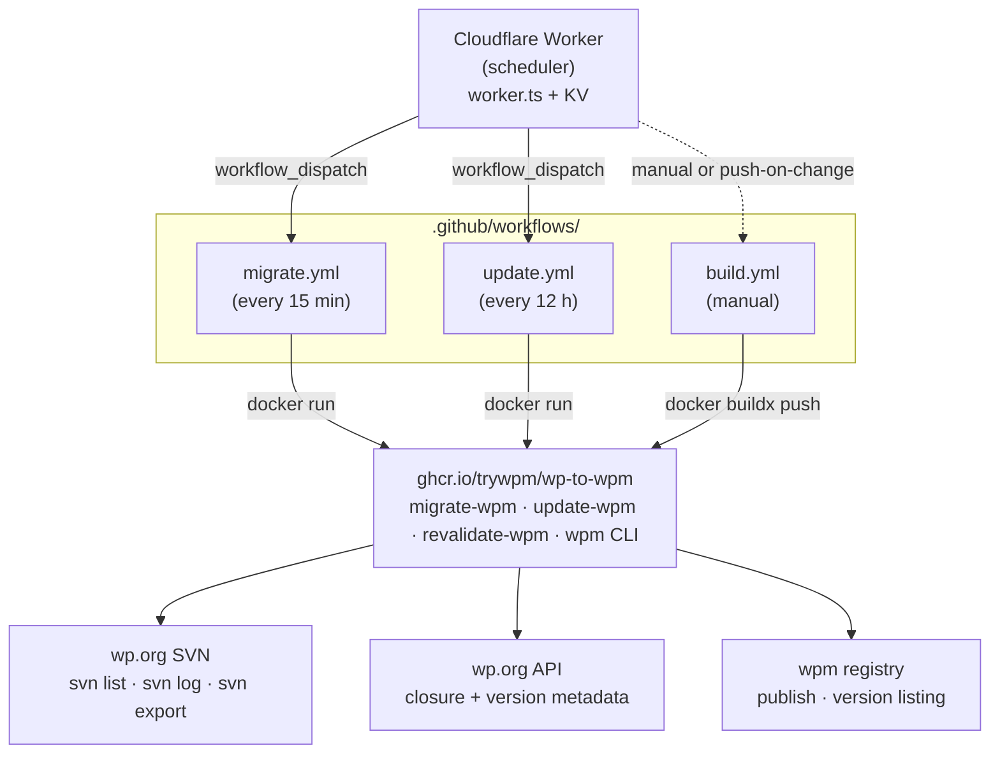
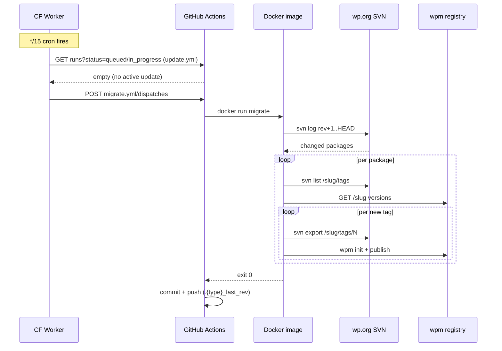
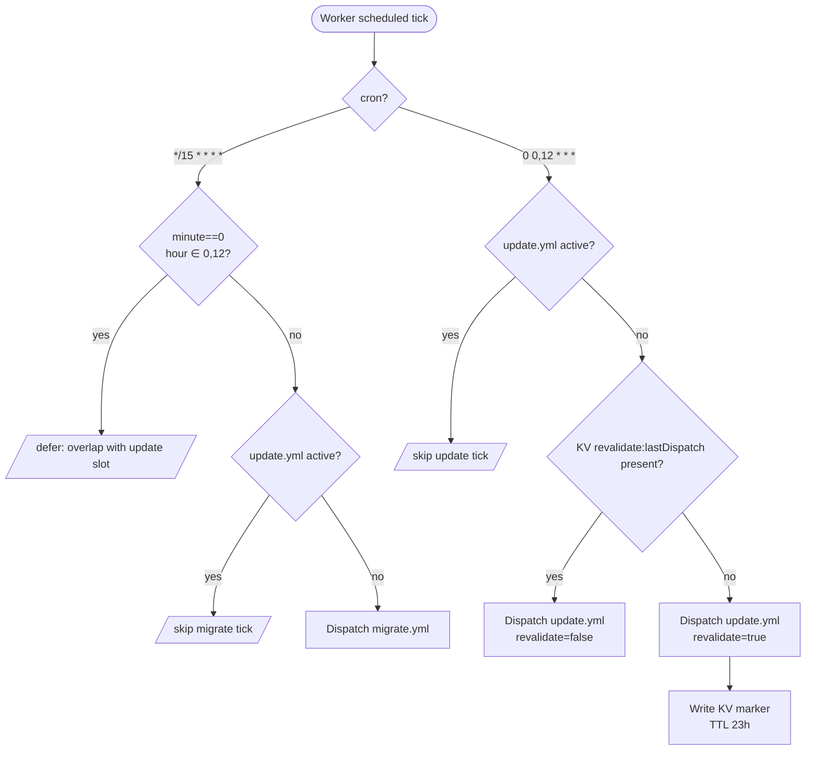
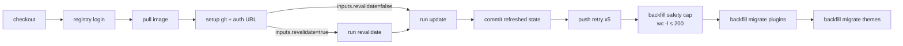
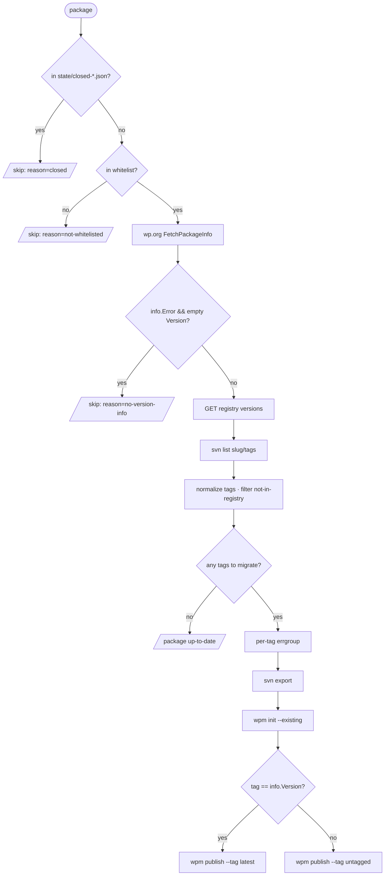

# wp-to-wpm service documentation

This service mirrors WordPress.org plugins and themes from their canonical
Subversion repositories into the [wpm](https://wpm.so) package registry. It runs
unattended on a schedule, picks up new releases from upstream, and publishes
each one as an immutable version on wpm.

Every plugin and theme on wp.org becomes a wpm package, and every tagged release
in its SVN tree becomes a published version of that package. The mirror is
append-only: it never deletes, never rewrites, and converges as upstream
changes.

The rest of this document explains how the parts fit together, what state they
keep, and what to do when something looks wrong.

## Design rationale

Three decisions shape everything below. They are recorded here because the
reasoning is not obvious from the code, and because each has a cost worth
knowing before you change it.

**State lives in git.** There is no database and no external state store. The
allowlists, closure lists, and SVN revision pointers are files under `state/`,
and every workflow that changes them commits the result back to `main`. This
buys an audit trail per state change (`git log -- state/plugin_last_rev` is the
migration history), point-in-time recovery by checking out a known-good file,
and reviewable diffs when a number looks wrong. The cost is that every state
change serializes through pushes to one branch, which the concurrency group and
the push retry loop in section 9 already absorb. At the current rate of a few
hundred commits a day this is comfortable. An order of magnitude more churn
would mean trimming history or moving to a real store, and that is the point at
which this decision should be revisited rather than defended.

**Compute is GitHub Actions, serialized by one concurrency group.** All three
workflows declare `group: migrate-pipeline`, so at most one runs at any moment.
Every reader and writer of the state files is therefore serialized by the
platform itself, which removes a whole class of races without a lock service,
leader election, or any reasoning about interleaving on our part. Section 9
covers what this does and does not protect against.

**Scheduling is a Cloudflare Worker, not `on: schedule`.** Actions' built-in
cron drifts under load and drops ticks, and more importantly it fires blind: it
cannot look at what is already running before it triggers. The worker holds the
cron instead, queries the Actions API for in-flight runs, and only dispatches
when it makes sense to. It also gates the daily revalidation behind a single KV
key with a 23-hour TTL, which makes that dispatch idempotent across missed,
delayed, or duplicated ticks. Section 4 covers the decision tree.

## 1. Architecture at a glance

A scheduler triggers workflows. The workflows run the binaries inside a
container. The binaries talk to upstream wp.org and to the wpm registry. The
diagram below shows the major pieces and how data flows between them.



The three runtime workflows (`migrate`, `update`, `build`) share a single
concurrency group called `migrate-pipeline`. GitHub Actions will only ever run
one of them at a time; anything else waits its turn. This matters because all
three read and write the same state files, and serializing them removes a whole
class of race conditions without us having to reason about them.

A typical migrate tick, end to end:



## 2. Repository layout

The Go services, the shell wrappers, the workflow definitions, the Cloudflare
worker, and the state files all live in the same repository. Keeping everything
in one place makes the audit trail trivial: every state change is just another
git commit.

```
.
├── cmd/
│   ├── migrate/main.go        # migrate-wpm binary
│   ├── update/main.go         # update-wpm binary
│   └── revalidate/main.go     # revalidate-wpm binary
├── pkg/
│   ├── svn/svn.go             # svn list / svn log / svn export
│   ├── wporg/wporg.go         # wp.org HTTP client (info + closure data)
│   ├── store/store.go         # JSON state files: load + atomic write
│   ├── version/version.go     # SVN tag to semver normalization
│   ├── validate/validate.go   # slug character validation
│   └── unsafeconv/            # zero-copy string ↔ []byte
├── .github/
│   ├── dependabot.yml
│   └── workflows/
│       ├── build.yml          # builds + pushes the Docker image
│       ├── migrate.yml        # the 15-min migration tick
│       └── update.yml         # the 12-h update + optional daily revalidate
├── entrypoint/
│   ├── migrate.sh             # wraps migrate-wpm inside the container
│   ├── update.sh              # wraps update-wpm
│   ├── revalidate.sh          # wraps revalidate-wpm
│   └── backfill-migrate.sh    # wraps migrate-wpm for the post-update pass
├── Dockerfile                 # multi-stage: go build → alpine + svn + wpm
├── worker.ts                  # Cloudflare Worker scheduler
├── wrangler.json              # Worker config (crons, KV binding)
├── tsconfig.json
├── worker-types.d.ts          # wrangler types, generated, gitignored
├── package.json
├── go.mod / go.sum
│
└── state/
    ├── themes.json            # canonical theme allowlist
    ├── plugins.json           # canonical plugin allowlist
    ├── conflicts.json         # slugs that exist as both theme & plugin
    ├── resolved.json          # human assignments for conflicts
    ├── closed-themes.json     # closed/withdrawn themes (skip list)
    ├── closed-plugins.json    # closed/withdrawn plugins (skip list)
    ├── theme_last_rev         # SVN rev pointer for the theme stream
    └── plugin_last_rev        # SVN rev pointer for the plugin stream
```

## 3. Data files (state)

All persistent state lives in the repo as JSON or plain-text files. Every write
goes through `pkg/store.atomicWrite`, which uses a tmp file plus `fsync` plus
rename. A crash mid-write cannot leave the file half-finished; readers see
either the old contents or the new ones, never anything in between.

State falls into two groups. The first describes the catalog: allowlists,
conflicts, closures. These are committed back to `main` after every workflow
that touches them.

| File                        | Owner               | Shape                                       | Purpose                                      |
| --------------------------- | ------------------- | ------------------------------------------- | -------------------------------------------- |
| `state/themes.json`         | update              | sorted `["slug", ...]`                      | Active theme allowlist                       |
| `state/plugins.json`        | update              | sorted `["slug", ...]`                      | Active plugin allowlist                      |
| `state/conflicts.json`      | update              | sorted `["slug", ...]`                      | Slugs colliding between themes & plugins     |
| `state/resolved.json`       | human               | `{"themes": [...], "plugins": [...]}`       | Manual conflict assignments                  |
| `state/closed-themes.json`  | update + revalidate | `{"slug": "permanent\|temporary\|unknown"}` | Themes wp.org reports as closed              |
| `state/closed-plugins.json` | update + revalidate | `{"slug": "permanent\|temporary\|unknown"}` | Plugins wp.org reports as closed             |
| `state/theme_last_rev`      | migrate             | bare integer                                | Last fully-processed SVN revision for themes |
| `state/plugin_last_rev`     | migrate             | bare integer                                | Same, for plugins                            |

The second group is scratch state, only used inside a single workflow run and
never committed: `pending-backfill-plugins.txt` and
`pending-backfill-themes.txt` (the handoff from `update` to `backfill-migrate`
within the same job), and `worker-types.d.ts` (regenerated each time you run
`wrangler types`).

## 4. Cloudflare Worker (`worker.ts`)

The worker is the system's clock. It does not process anything itself; it
decides when to wake the workflows up. It exists instead of an `on: schedule`
trigger because it can do two things Actions cron cannot: look at what is
currently running and decline to dispatch, and persist a marker across ticks so
a once-a-day job stays once a day even when cron misfires. Two cron schedules
are configured:

```jsonc
// wrangler.json
"crons": [
  "*/15 * * * *",   // every 15 min → migrate
  "0 0,12 * * *"    // 00:00 and 12:00 UTC → update (00:00 also revalidates)
]
```

### 4.1 Per-tick decision

Each time a cron fires the worker walks a small decision tree before dispatching
anything. It needs to make sure it is not stepping on an already-running
workflow, and (for the daily update) that it is not re-triggering a revalidation
that already happened today.

| Cron fires     | Worker action                                                                                                                                                                                                                                                                                                                                  |
| -------------- | ---------------------------------------------------------------------------------------------------------------------------------------------------------------------------------------------------------------------------------------------------------------------------------------------------------------------------------------------- |
| `*/15 * * * *` | If the time happens to be the top of an "update slot" (00:00 or 12:00), defer this tick so the simultaneous update cron wins cleanly. If `update.yml` is already running or queued, skip; there is no point queueing migrate behind it. Otherwise dispatch `migrate.yml`.                                                                      |
| `0 0,12 * * *` | If `update.yml` is already in flight, skip (avoid double-dispatch). Otherwise look up the KV key `revalidate:lastDispatch`. If it is present, the daily revalidate already happened in the current 24-hour window, so dispatch with `revalidate=false`. If it is absent, dispatch with `revalidate=true` and write the key with a 23-hour TTL. |



### 4.2 KV gate

The KV namespace bound as `kv` holds exactly one key: `revalidate:lastDispatch`.
Its presence tells the worker that a revalidate dispatch already happened in
this 24-hour window. The 23-hour TTL means the key always expires before the
next 00:00 slot, so the next day starts with a clean slate even if Cloudflare's
cron drifts by a few minutes.

The key is only written after the dispatch HTTP call succeeds. A failed dispatch
leaves the key absent and the next tick retries; there is no way for a failed
dispatch to falsely mark the day as done.

## 5. GitHub Actions workflows

All three workflows are triggered by `workflow_dispatch` only. There is no
`on: schedule` and no `on: push`. Scheduling lives in the worker instead, for
the reasons in the design rationale: Actions cron drifts, drops ticks, and
cannot inspect running state before it fires, while the worker can query the API
and decide not to dispatch at all. In normal operation the worker is the only
thing firing these, but any of them can be dispatched by hand from the GitHub UI
and will behave identically.

### 5.1 `build.yml`

Builds the multi-arch Docker image and pushes it to `trywpm/wp-to-wpm:latest`.
Run manually after code changes. Does not touch repository state.

### 5.2 `migrate.yml`

The 15-minute heartbeat. Runs as a matrix over `{theme, plugin}`, with the two
matrix jobs running side by side. Each does the same thing for its package type:
check out the repo, run `docker run migrate` (which calls `migrate-wpm` for the
corresponding type), then commit the advanced `.{type}_last_rev` pointer and
push.

The two matrix jobs both push to `main` at roughly the same time, so push
contention is the obvious concern. A retry loop handles it; see the concurrency
section.

Commit messages embed the rev range, so `git log -- state/plugin_last_rev` is a
complete audit trail:

```
migrate(plugin): advance svn rev 3000000..3000150
```

### 5.3 `update.yml`

The 12-hour catalog refresh, plus (at 00:00) the daily closure-list cleanup.
Single job, sequential steps. Takes a `revalidate: boolean` input from the
worker.



`revalidate` and `update` are two steps in the **same job** so they cannot get
decoupled. Revalidate prunes some entries from the closure lists; update
immediately re-checks wp.org and re-adds whichever entries are still actually
closed. Only the final state, after both steps have run, gets committed back to
`main`. Externally there is no observable window where the closure list is
pruned but not yet repopulated.

## 6. Go binaries

### 6.1 `cmd/migrate` (`migrate-wpm`)

The workhorse. Given a list of package slugs to process (picked up from
`svn log` or passed as CLI arguments), it figures out which tags are new,
downloads each one from SVN, and publishes it to the wpm registry.

| Flag                | Default           | Purpose                                      |
| ------------------- | ----------------- | -------------------------------------------- |
| `--type, -t`        | (required)        | `plugin` or `theme`                          |
| `--registry, -r`    | `registry.wpm.so` | wpm registry hostname                        |
| `--concurrency, -c` | 2                 | Per-package parallel-tag-publish limit       |
| `--tag-timeout`     | `8m`              | Per-tag deadline for export + init + publish |

The binary operates in one of two modes depending on whether you pass slugs:

| Args                                  | Source of packages    | Rev pointer                | Used by                                 |
| ------------------------------------- | --------------------- | -------------------------- | --------------------------------------- |
| `migrate-wpm -t plugin`               | `svn log rev+1..HEAD` | advanced on successful run | `migrate.yml`                           |
| `migrate-wpm -t plugin slug1 slug2 …` | the args verbatim     | **not** touched            | `backfill-migrate.sh`, manual one-shots |

The CLI-args mode is what makes backfill and manual force-migration safe. You
can re-run a slug as many times as you like and the rev pointer never moves, so
nothing else gets thrown off.

For each package the binary follows this pipeline:



Errors are kept as local as possible. A single tag publish failing produces a
`Tag failed step=…` log line and the next tag for the same package keeps going.
A whole package failing produces a `Package error` line and the next package
keeps going. If the run is interrupted (Ctrl-C, SIGTERM), the binary exits
cleanly without advancing the rev pointer, so the next run picks up where this
one left off.

Two safety caps guard against catastrophic scenarios:

| Trigger                                              | Behavior                                                                                                                                                                              |
| ---------------------------------------------------- | ------------------------------------------------------------------------------------------------------------------------------------------------------------------------------------- |
| `.{type}_last_rev` missing or zero, and no CLI slugs | Refuse to run with `refusing to scan svn from rev 1: .{type}_last_rev is missing or 0`. Stops the binary from accidentally scanning the entire SVN history.                           |
| `svn log` returns more than 1000 distinct packages   | Refuse to run with `svn log returned N packages (safety cap 1000)`. Stops the binary from trying to migrate the whole catalog in one shot if the rev pointer somehow gets very stale. |

### 6.2 `cmd/update` (`update-wpm`)

The catalog refresher. Once every 12 hours it asks wp.org which plugins and
themes exist right now, and which of them are closed. It writes that information
into the JSON state files and identifies new entries that should be migrated,
leaving them in a scratch file for `backfill-migrate` to consume in the next
step.

Flow:

1. Snapshot `state/themes.json` and `state/plugins.json` as they are right now
   (needed for the diff later).
2. In parallel, `svn list` the plugin and theme SVN roots to get the full
   canonical catalogs.
3. Compute conflicts (slugs that exist in both) and apply `state/resolved.json`
   overrides.
4. Write the refreshed `state/themes.json`, `state/plugins.json`, and
   `state/conflicts.json`.
5. Load the existing `state/closed-*.json` files.
6. In parallel, hit the wp.org metadata API for every slug not already marked
   closed.
7. Classify each response and write the refreshed `state/closed-*.json` files.
8. Compute the backfill diff (new slugs that are not closed) and write
   `pending-backfill-*.txt`.

The plugin classification rules (themes only ever get `ClosureUnknown` because
wp.org's themes API does not distinguish):

| wp.org `Error` value      | Description match                       | Classification     |
| ------------------------- | --------------------------------------- | ------------------ |
| `"closed"`                | contains `"This closure is permanent."` | `ClosurePermanent` |
| `"closed"`                | anything else                           | `ClosureTemporary` |
| any other non-empty value | (any)                                   | `ClosureUnknown`   |

Three safety caps protect against catastrophic scenarios:

| Trigger                                                                | Behavior                                                                                                                         |
| ---------------------------------------------------------------------- | -------------------------------------------------------------------------------------------------------------------------------- |
| Either SVN listing returns fewer than 1000 entries                     | Fatal. Refuse to overwrite the allowlists. Protects against upstream HTML/format breakage silently wiping the data.              |
| `state/themes.json` or `state/plugins.json` is unreadable or corrupted | Fatal on read. An empty snapshot would otherwise make every slug look new and explode the backfill list.                         |
| Backfill diff exceeds 200 entries per type                             | Log an error, clear the pending file, write empty. The workflow then repeats the same check with `wc -l` as belt-and-suspenders. |

### 6.3 `cmd/revalidate` (`revalidate-wpm`)

A small binary with one job: open `state/closed-themes.json` and
`state/closed-plugins.json`, delete every entry whose value is not
`ClosurePermanent`, and write them back. It runs once a day (only when
`update.yml` is invoked with `revalidate=true`), and the `update` step that
follows in the same workflow re-fetches wp.org and re-marks anything that is
still actually closed.

Permanent closures are never touched. That is the only invariant `revalidate` is
responsible for upholding.

## 7. Shell wrappers

Each Go binary has a thin shell wrapper under `entrypoint/`. The wrappers handle
the wpm CLI login, mask the token in GitHub Actions logs, and pass through
environment variables that the workflows set on `docker run`. The Dockerfile
installs each wrapper into `/usr/local/bin/` under its short name (without the
`.sh` suffix), so workflows invoke them by name.

| Wrapper                          | Installed as       | Binary it invokes | Env in                                     | What it does                                                                                                                   |
| -------------------------------- | ------------------ | ----------------- | ------------------------------------------ | ------------------------------------------------------------------------------------------------------------------------------ |
| `entrypoint/migrate.sh`          | `migrate`          | `migrate-wpm`     | `PACKAGE_TYPE`, `WPM_TOKEN`, `CONCURRENCY` | Logs into wpm, then runs migrate-wpm with the type and concurrency from the env.                                               |
| `entrypoint/update.sh`           | `update`           | `update-wpm`      | (none)                                     | Plain wrapper. No token needed since update does not talk to wpm.                                                              |
| `entrypoint/revalidate.sh`       | `revalidate`       | `revalidate-wpm`  | (none)                                     | Plain wrapper.                                                                                                                 |
| `entrypoint/backfill-migrate.sh` | `backfill-migrate` | `migrate-wpm`     | `PACKAGE_TYPE`, `WPM_TOKEN`, `CONCURRENCY` | Logs in, then xargs each slug from `pending-backfill-${TYPE}s.txt` to migrate-wpm. Skips cleanly if the pending file is empty. |

`migrate.sh` and `backfill-migrate.sh` both call
`wpm auth login --token "$WPM_TOKEN"` first, prefixed by `echo "::add-mask::"`
so the token never appears in Actions logs.

## 8. Docker image

Multi-stage build. The builder stage compiles the three Go binaries statically.
The runtime stage is `alpine` plus `subversion` plus the `wpm` CLI copied from
the upstream `trywpm/cli:latest` image.

```
/usr/local/bin/
  ├─ update-wpm                 (binary)
  ├─ migrate-wpm                (binary)
  ├─ revalidate-wpm             (binary)
  ├─ wpm                        (from trywpm/cli:latest)
  ├─ update                     (shell wrapper)
  ├─ migrate                    (shell wrapper)
  ├─ revalidate                 (shell wrapper)
  └─ backfill-migrate           (shell wrapper)
```

The image runs as a non-root user called `loki`. The workdir is `/code`.
Workflows mount the runner's checked-out repo there so the binaries read and
write the state files in place. `CMD ["/usr/local/bin/migrate"]` is the default
entrypoint, but every workflow overrides it by passing a wrapper name to
`docker run`.

## 9. Concurrency model

All three live workflows declare:

```yaml
concurrency:
  group: migrate-pipeline
  cancel-in-progress: false
```

This means GitHub Actions guarantees that at most one workflow in the
`migrate-pipeline` group is `in_progress` at any moment. When something else
tries to start it goes into `queued` state. GitHub's policy for queued runs is:
if a second one shows up while one is already queued, the older queued run gets
cancelled and the newer one waits. The queue never grows beyond one. Active runs
are never preempted by newer dispatches.

The one race we have to actively prevent is **migrate running while revalidate
has pruned closures but update has not re-populated them yet**. If that
happened, migrate would see many "closed" packages as newly-eligible and start
hammering wp.org and the registry for things that are actually still closed.
There are three independent defences against this; any one of them is sufficient
on its own:

1. **Step ordering inside the workflow.** Revalidate and update are sequential
   steps in the _same_ job in `update.yml`. The pruned closure list only ever
   exists in the runner's workspace between those two steps. The single commit
   at the end of the job captures only the final refreshed state. There is no
   moment when `main` has a pruned-but-not-repopulated closure list.
2. **Worker `hasActiveRun` check.** Before dispatching migrate, the worker
   queries the GitHub API to see if `update.yml` has any active runs. If it
   does, the worker does not dispatch.
3. **The concurrency group.** Even if the worker's check somehow misses (network
   race, API lag), a dispatched migrate would still queue behind the running
   update.

The other concurrency concern is push contention. The `migrate.yml` matrix runs
theme and plugin in parallel; both finish around the same time, both want to
push their own `.{type}_last_rev` to `main`. The push step handles this with a
retry loop that re-bases up to five times with linear backoff:

```bash
for attempt in 1 2 3 4 5; do
  git pull --rebase origin main || { git rebase --abort; sleep $((attempt*2)); continue; }
  git push origin main && exit 0
  sleep $((attempt*2))
done
```

With a maximum of 30 seconds of cumulative backoff, push races between the
matrix siblings (or between workflows) resolve cleanly without manual
intervention.

## 10. Failure modes & safety caps

The system is built so that everything fails loudly, recovers automatically
where possible, and refuses to do anything catastrophic. The table lists the
failure modes the system actively handles.

| Failure                                              | What stops it                                                                                        | Recovery                                                                 |
| ---------------------------------------------------- | ---------------------------------------------------------------------------------------------------- | ------------------------------------------------------------------------ |
| `.{type}_last_rev` lost or set to 0                  | migrate refuses to run with an explicit error                                                        | Operator seeds the file from `svn info \| grep Revision`                 |
| Long SVN log range (catch-up after a big gap)        | migrate refuses if more than 1000 packages would be processed                                        | Operator advances `.{type}_last_rev` in chunks                           |
| `state/themes.json` / `state/plugins.json` corrupted | `logger.Fatal()` on read                                                                             | Restore from git and re-run                                              |
| Upstream SVN listing format breaks                   | update refuses if the catalog returns fewer than 1000 entries                                        | Investigate manually; existing state is left untouched                   |
| Suspiciously large backfill diff                     | Go-side 200-entry cap + workflow-side `wc -l` check                                                  | Operator decides whether the spike is legitimate                         |
| Truncated SVN response mid-stream                    | `cmd.Output()` buffers the whole response before parsing, so `xml.Unmarshal` never sees partial data | Next tick retries automatically                                          |
| wp.org API rate limit                                | `pkg/wporg` retries three times with exponential backoff                                             | Next tick retries automatically                                          |
| Per-tag publish timeout                              | `--tag-timeout` (8 minutes) kills the subprocess                                                     | Other tags keep going; the failed tag is simply absent from the registry |
| Per-package error                                    | Logged and skipped                                                                                   | The next migrate tick picks the package up again via the SVN log         |
| Workflow run fails after dispatch                    | KV marker may still hold "today done"                                                                | At most 24 h of revalidate staleness; next day's run recovers            |
| CF Worker cron drop                                  | KV marker either expires or was never written                                                        | Next tick attempts                                                       |
| `GITHUB_TOKEN` / `WPM_TOKEN` expired                 | All dispatches or publishes fail loudly                                                              | Operator rotates the token                                               |
| Brand-new plugin with no `/tags/` directory          | `svn list` returns "non-existent", treated as empty                                                  | Migrate logs `Package up-to-date`; no error                              |
| Two SVN tags that normalise to the same semver       | Both attempt to publish; the registry rejects the second                                             | Self-heals on the next run via the `publishedVersions` check             |

## 11. Observability

### 11.1 Log fields

Every Go binary emits structured JSON via zerolog. When `CI=true` is set in the
container environment and a `NEW_RELIC_LICENSE_KEY` is present, the logs are
also forwarded to New Relic under the application name `wp-to-wpm migrate`.

The fields below are what to query on:

| Field      | Set by               | Use                                                                                                       |
| ---------- | -------------------- | --------------------------------------------------------------------------------------------------------- |
| `level`    | zerolog              | Filter info / warn / error                                                                                |
| `message`  | `.Msg()`             | The human-readable event name                                                                             |
| `type`     | pkgLogger in migrate | `plugin` or `theme`                                                                                       |
| `package`  | pkgLogger            | The slug being processed                                                                                  |
| `tag`      | tagLogger            | The raw SVN tag                                                                                           |
| `version`  | tagLogger            | The normalised semver                                                                                     |
| `step`     | error events         | One of `svn-export`, `wpm-init`, `wpm-publish`, `fetch-info`, `fetch-published-versions`, `list-svn-tags` |
| `dist_tag` | tag-success events   | `latest` or `untagged`                                                                                    |
| `duration` | summary events       | Wall-clock time                                                                                           |

### 11.2 Commit messages

The workflows commit with structured subjects and bodies. The migrate commits
encode the rev range they covered. The update commits include current state
counts in the body, which doubles as a quick anomaly detector: if today's
`closed-plugins` count is dramatically different from yesterday's, something is
worth investigating.

| Workflow            | Subject                                             | Body                                                              |
| ------------------- | --------------------------------------------------- | ----------------------------------------------------------------- |
| migrate             | `migrate(plugin): advance svn rev 3000000..3000150` | (none)                                                            |
| migrate             | `migrate(theme): advance svn rev 5000000..5000020`  | (none)                                                            |
| update              | `update: refresh whitelists and closure status`     | `themes=N plugins=M conflicts=K closed-themes=A closed-plugins=B` |
| update (revalidate) | `update: revalidate closures, refresh whitelists`   | same body shape                                                   |

Useful queries: `git log --grep "^migrate(plugin)"`,
`git log --grep "revalidate closures"`,
`git log -p -- state/closed-plugins.json`.

## 12. Secrets and config

### 12.1 GitHub repo secrets

| Secret                  | Used in                     | Scope                                         |
| ----------------------- | --------------------------- | --------------------------------------------- |
| `WPM_TOKEN`             | `migrate.yml`, `update.yml` | wpm registry publish token                    |
| `NEW_RELIC_LICENSE_KEY` | same                        | New Relic Ingest License key (not a User key) |
| `GITHUB_TOKEN`          | auto-injected               | Used inline in the git remote URL for push    |

### 12.2 Cloudflare Worker

| Secret         | Provisioned via                    | Scope                                                                                  |
| -------------- | ---------------------------------- | -------------------------------------------------------------------------------------- |
| `GITHUB_TOKEN` | `wrangler secret put GITHUB_TOKEN` | Fine-grained PAT, scoped to **Repository → Actions: Read and write** on this repo only |

The repo owner, name, and branch (`OWNER`, `REPO`, `REF`) are hardcoded as
constants in `worker.ts`; they do not change per environment. The KV namespace
bound as `kv` holds exactly one key: `revalidate:lastDispatch`, with a 23-hour
TTL.

## 13. Operations

### 13.1 Token rotation

Each token has its own loop. None of them auto-recover. When a token expires the
relevant part of the pipeline starts failing loudly and stays failed until you
rotate.

- **Worker `GITHUB_TOKEN`.** Fine-grained PATs have a maximum 1-year lifetime.
  When it expires `wrangler tail` shows `dispatch … failed: 401`. Rotate with
  `wrangler secret put GITHUB_TOKEN` after creating a new PAT with the same
  Actions: Read+Write scope.
- **`WPM_TOKEN`.** When it expires migrate runs show
  `Tag failed step=wpm-publish` with `user must be logged in` in stderr. Rotate
  from the repo's Settings → Secrets and variables → Actions.
- **`NEW_RELIC_LICENSE_KEY`.** When it expires NR APM stops receiving data;
  nothing in the workflow itself fails. Rotate from the same Actions secrets
  page.

### 13.2 Force-migrating a known slug

Sometimes you need to run migrate against specific packages on demand. For
example after fixing a transient upstream issue, or to verify a particular slug
end to end. The CLI-args mode of `migrate-wpm` is designed for this. It bypasses
the SVN log entirely, does not advance the rev pointer, and still respects the
closures and whitelist:

```bash
docker run --rm \
  -e CI=true -e CONCURRENCY=2 \
  -e WPM_TOKEN=<token> \
  -e NEW_RELIC_LICENSE_KEY=<key> \
  -v "$PWD:/code" \
  trywpm/wp-to-wpm:latest \
  sh -c 'wpm auth login --token $WPM_TOKEN && migrate-wpm --type plugin foo-plugin bar-plugin'
```

Tags that are already in the registry are skipped automatically thanks to the
`publishedVersions` check, so re-running on the same slug is idempotent.

### 13.3 Clearing a wrong closure

If a package is wrongly marked as closed (or you suspect wp.org has reopened it
since the last revalidation), edit the corresponding
`state/closed-{plugins,themes}.json` and remove the slug. The next `update` run
hits wp.org for it. If it is actually still closed, the entry gets re-added with
whatever closure state wp.org now reports. If it is actually open it stays out
of the file and becomes eligible for migration again on the next 15-minute tick.

For non-permanent closures no manual action is needed. `revalidate-wpm` clears
them automatically every day at 00:00 UTC, and the `update` step right after
re-marks whichever ones are still closed.
